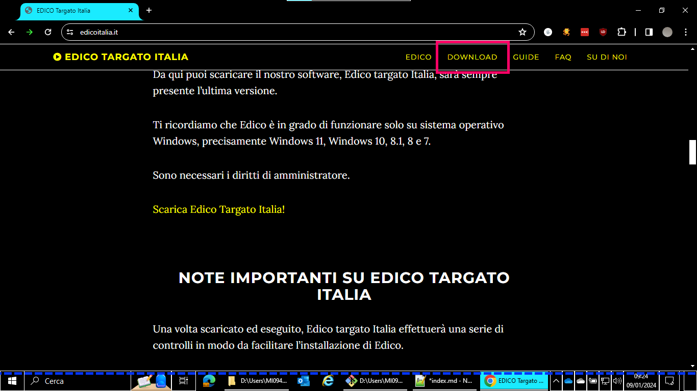
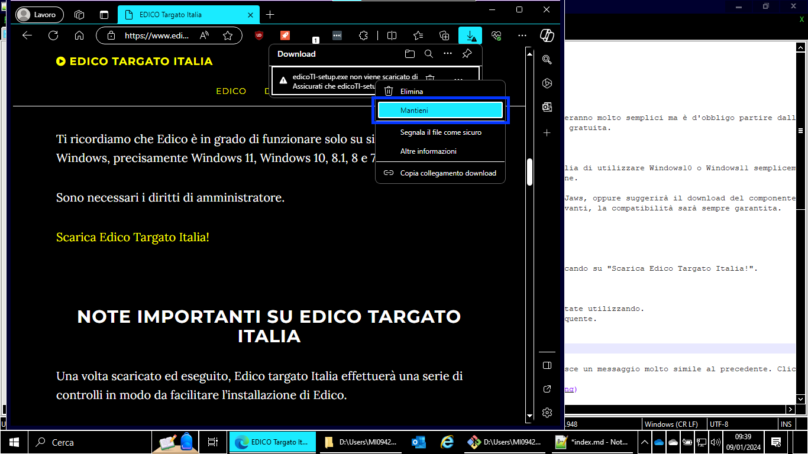
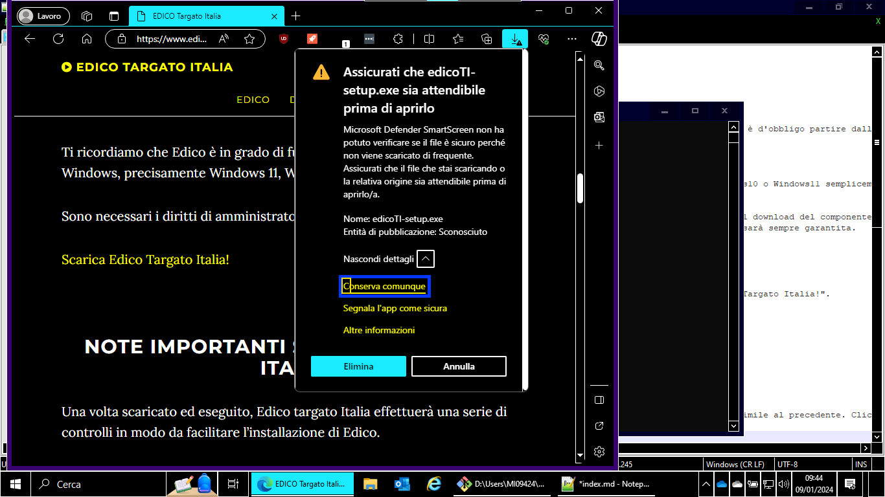

# Installare EDICO
----

In questo semplice tutorial vedremo come installare EDICO in un sistema operativo Windows. Le operazioni risulteranno molto semplici ma è d'obbligo partire dall'inizio. 
Cominceremo con il download del software, procedendo poi con l'installazione fino all'attivazione della licenza gratuita.

## Requisiti di sistema
Per funzionare, Edico ha bisogno di un sistema operativo uguale o superiore a Windows7. Generalmente, si consiglia di utilizzare Windows10 o Windows11 semplicemente in quanto anche i lettori di schermo quali NVDA o Jaws risultano molto più prestanti e aggiornati per le nuove versioni di Windows.
Inoltre, risulta obbligatorio disporre dei diritti di amministratore nel momento in cui si esegue l'installazione.
Non è possibile in alcun modo utilizzare Edico in versione portable.
Il setup di Edico controllerà quale screen reader è in uso, dopodiché provvederà o a installare gli script per Jaws, oppure suggerirà il download del componente aggiuntivo relativo a NVDA.
Tale controllo viene effettuato anche all'esecuzione di Edico, per cui se si installerà uno screen reader più avanti, la compatibilità sarà sempre garantita.

## Scaricare Edico
Ottenere Edico è molto semplice, basterà recarsi al seguente collegamento:
[HomePageEdicoItalia](http://www.edicoitalia.it){:target="\_blank"}

Sul sito troverete moltissime informazioni utili, spostatevi alla sezione download e scaricate il software cliccando su "Scarica Edico Targato Italia!".

  

Una volta che il download terminerà, potreste ricevere alcuni messaggi di sicurezza a seconda del browser che state utilizzando.
Nel caso più complesso, Microsoft Edge fornirà una serie di avvisi in quanto il file non viene scaricato di frequente.
Sarà necessario perciò cliccare col tasto destro sul file e selezionare mantieni.

  

Successivamente, talvolta interviene anche la funzione di protezione di Windows chiamata SmartScreen, che fornisce un messaggio molto simile al precedente. Cliccare su "ulteriori dettagli" come mostrato in figura.

  

Cliccare poi su "conserva comunque".

Nel caso si stia utilizzando la tastiera e non il mouse, ricordiamo che nei browser si può utilizzare il tasto f6 per passare da una sezione all'altra (barra degli indirizzi, barra dei download, pagina web), e che per aprire l'elenco dei file appena scaricati è necessario premere ctrl-j.

**Si ricorda altresì che Edico non contiene alcun virus, malware o codice malevolo; i messaggi di allerta del sistema operativo vengono visualizzati in quanto Edico non può essere considerato un programma particolarmente diffuso, perciò i database di Microsoft non lo considerano attendibile. In futuro questo comportamento potrebbe terminare.

## Installare Edico

Si tratta di un'operazione davvero agevole. Il setup italiano è stato realizzato in modo da non creare alcuna difficoltà.
Unica accortezza, naturalmente è necessario concedere al programma i diritti di amministratore quando richiesto, in caso contrario l'installazione non potrà continuare.
Se durante l'installazione vi è uno screen reader in esecuzione tra quelli supportati (NVDA e Jaws), il setup installerà il componente aggiuntivo o gli script necessari.
Inoltre, è bene ricordare che questo controllo verrà effettuato ogni qualvolta si eseguirà Edico, di conseguenza non c'è da preoccuparsi se i componenti aggiuntivi non sono stati installati la prima volta.

## Come attivare la licenza

Una volta installato Edico, è giunto il momento di eseguirlo.
La prima videata mostrerà le novità dell'ultima versione, ma giacché per voi probabilmente è la prima volta, tutto risulterà nuovo!
Andate avanti e vi verrà chiesto di attivare la licenza.
Edico è completamente gratuito, ma per funzionare c'è bisogno di una licenza legata al seriale del computer in uso, rilasciata dalla Once, l'associazione non vedenti e ipovedenti spagnola.
Se non volete attivare la licenza, è possibile usare Edico in modalità demo per sei volte tramite l'apposito pulsante.

Nella finestra relativa alla licenza, il cursore viene posizionato su un campo editazione all'interno del quale è presente il vostro codice pc.
Tramite la pressione del tasto tab possiamo spostarci sul pulsante "copia", per copiare il codice negli appunti, oppure sul pulsante "richiedi via email" che è l'opzione che consigliamo purché abbiate un software di posta elettronica installato.
Una terza pressione del tasto tab porterà al campo editazione dove incollare il codice ricevuto via email.

Una volta incollato il codice sarà possibile attivare Edico cliccando sull'apposito pulsante.

Tenete presente che l'email autogenerata è per ovvie ragioni in spagnolo e conviene rimanga in quella lingua;  nel caso in cui non aveste un programma di posta elettronica installato, dovete scrivere a:

saucti@once.es

incollando poi nel corpo del messaggio il vostro codice pc.

Ad ogni modo l'attivazione è completamente guidata, i tempi sono piuttosto rapidi, alcuni utenti hanno ricevuto l'attivazione dopo qualche ora, qualcuno dopo 24 ore, ma generalmente il servizio è di ottima qualità.

Questo tutorial termina qui, ora siete pronti ad iniziare ad usare Edico!

