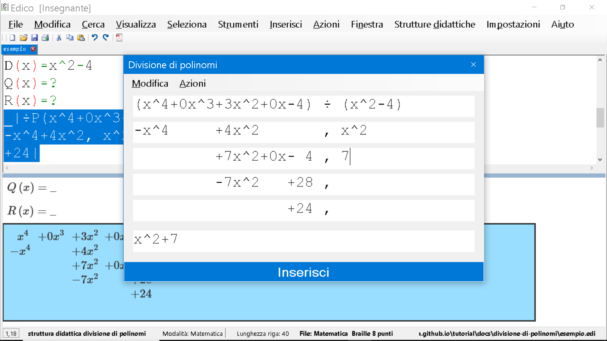

# Le divisioni dei polinomi con EDICO

La divisione dei polinomi è un'operazione comune in algebra. 
In questo tutorial, spiegheremo come dividere i polinomi utilizzando EDICO.

## Esempio: (x^4 + 3x^2 - 4) ÷ (x^2 - 4)

Per prima cosa identifico i due polinomi, \(P(x)\) e \(D(x)\), cioé il dividendo e il divisore e li scrivo.
La divisione produce due risultati: un quoziente \(Q(x)\) e un resto \(R(x)\).

### 1. Definizione dei polinomi:

Vado a scrivere questi polinomi in EDICO, normalmente, senza usare la struttura didattica dove:

- \(P(x)\): Questo è il polinomio dividendo. Nel nostro esempio, \(P(x) = x^4 + 3x^2 - 4\) è il polinomio che vogliamo dividere.

- \(D(x)\): Questo è il polinomio divisore. Nel nostro esempio, \(D(x) = x^2 - 4\) è il polinomio con il quale stiamo dividendo \(P(x)\).

- \(Q(x)\): Questo è il quoziente. Durante la divisione, otteniamo un risultato che chiamiamo \(Q(x)\), che rappresenta quante volte il polinomio divisore \(D(x)\) si adatta al polinomio dividendo \(P(x)\).

- \(R(x)\): Questo è il resto. Dopo aver ottenuto il quoziente, può esserci un residuo che non può essere ulteriormente diviso per il polinomio divisore. Questo residuo è chiamato \(R(x)\).

e quindi scriverò:

\(P(x) = x^4 + 3x^2 - 4\)

\(D(x) = x^2 - 4\)

\(Q(x) = ?\)

\(R(x) = ?\)

Quindi dobbiamo dividere \(P(x)\) per \(D(x)\). 

Assicuriamoci che entrambi i polinomi siano ordinati in ordine decrescente delle potenze. Completiamo aggiungendo \(+0x^3\) e \(+0x\), dato che manca il fattore di primo grado. Quindi riscrivo la mia operazione, la seleziono, e dopo averlo fatto dal menu *Strutture didattiche* scelgo *Divisione di polinomi*:

Mi comparirà una schermata, nella quale troverò la mia operazione già impostata con, nella prima riga il dividendo (\(P(x)\)) il simbolo di divisione e il divisore (\(D(x)\))

### 2. Divide il termine di grado più alto di \(P(x)\) per il termine di grado più alto di \(D(x)\)

Dividiamo \(x^4\) per \(x^2\), ottenendo \(x^2\), che è il termine di grado più alto di e lo riportiamo sotto, in seconda riga, seconda colonna.

Noto che in ultima riga il programma si preoccupa di riportarmi lo stesso numero, non me ne preoccupo per ora.

### 3. Moltiplica il risultato per \(D(x)\) e sottrai da \(P(x)\)

Moltiplichiamo \(x^2\) per \(D(x)\) e sottraiamo il risultato da \(P(x)\) (cambiamo di segno e facciamo la somma). 

- Quindi quanto fa \(x^2 \cdot (x^2-4) \) ? Facciamo i conti e fa \(x^4-4x^2 \)
- Lo cambiamo di segno e diventa (-x^4+4x^2 \)

Lo riportiamo nella seconda riga, prima colonna (resto):

Aggiungiamo una riga, dal menu *Modifica*, *Nuova riga* o premendo CTRL+N.

Calcoliamo il resto facendo le somme:

### 4. Ripeti il processo

Aggiungiamo una riga, dal menu *Modifica*, *Nuova riga* o premendo CTRL+N.
Continua il processo finché il grado del resto è inferiore al grado di \(D(x)\). Ricordiamoci sempre di andare ad aggiungere i vari membri del quoziente in seconda colonna.

Dal menu *Azioni* è possibile spostarsi velocemente al Quoziente, all'ultima riga del resto e al risultato.

Quando abbiamo terminato, scegliamo *Inserisci* o battiamo **INVIO** .

### 5. Scrivi il risultato finale

Il risultato della divisione è \(Q(x) = x^2 + 7\), e il resto è \(R(x) = 24\). Quindi, \(P(x) = D(x) \cdot Q(x) + R(x)\).

## Allegati
[Gli esempi di questo tutorial sono disponibili già completati a questo link](esempio.edi)
