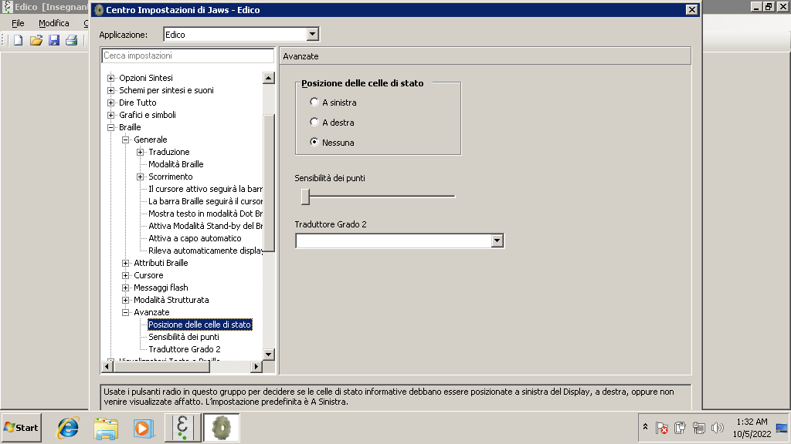

# EDICO e JAWS: consigli per la configurazione
----

Lo screen reader JAWS è in grado di integrarsi in modo ottimale con EDICO, così da offrire un'esperienza d'uso di qualità sia per ciò che riguarda il Braille sia per il supporto della sintesi vocale.

In questo breve tutorial andremo a vedere quali opzioni configurare così da poter lavorare con JAWS e EDICO in modo ottimale.

## Versioni di JAWS supportate
EDICO è in grado di lavorare con **la versione di JAWS 17 e successive**. Se si usano versioni precedenti di JAWS, potrebbe non essere disponibile un supporto braille di qualità durante l'uso di EDICO.

## Installazione degli script
All'avvio di EDICO, qualora venga rilevata una versione di JAWS compatibile, apparirà un messaggio a schermo che propone l'installazione degli script necessari al buon funzionamento del programma.
  

E' necessario disporre dei diritti di amministratore per poter completare l'operazione. Premere INVIO per continuare.

Alla successiva schermata, scegliere Sì, per proseguire con i diritti di amministratore.
  

Confermare infine premendo nuovamente INVIO al successivo messaggio:
  

Apriamo nuovamente EDICO. Ci verrà presentato un nuovo messaggio, per proseguire basterà premere INVIO.
  

Alla successiva schermata, scegliere Sì, per proseguire con i diritti di amministratore.
  

Insomma, invio invio invio e l'installazione degli script viene conclusa in automatico. L'unica accortezza è verificare di possedere i diritti di amministratore prima di procedere a questa configurazione.

## Configurazione del display braille in EDICO
Affinché lo scorrimento del display braille funzioni correttamente, è consigliabile impostare correttamente la dimensione del proprio display braille nelle impostazioni di EDICO.
Per fare questo procedere come segue:

1. Aprire EDICO;
2. Dal menu Impostazioni, scegliere Preferenze (come in figura);   
3. Nella finestra di dialogo che appare, individuare la voce "Lunghezza riga". Se vi muovete con la tastiera, potete usare il tasto TAB per scorrere le varie voci. Altrimenti potete raggiungere questa impostazione con il mouse. 
4. Scegliere la dimensione in base al proprio display braille (40 per una riga braille a 40 caratteri).
5. Premere ESC per chiudere la finestra e salvare le modifiche.

## Consigli per la configurazione di JAWS.
Alcune configurazioni di JAWS possono rendere più facile il suo utilizzo con EDICO.

Si consiglia di attivare la funzione di aggancio del cursore attivo al display braille. Per fare questo procedere come segue:

1. Assicurarsi di avere JAWS attivo e di avere focalizzata l'applicazione EDICO. Per essere sicuri, premere INSERT+T, la sintesi vocale dovrebbe leggere: "Edico"
2. Premere tastojaws+F2 (di solito INSERT+F2) per aprire le utility di JAWS.
3. Nella finestra di dialogo che appare, scorrere con le frecce fino a raggiungere "Centro Impostazioni" quindi confermare con INVIO. 
4. Premere TAB e scorrere la visualizzazione ad albero fino a raggiungere Braille, premere freccia a destra per aprire la voce, scorrere fino a raggiungere "Generale", quindi premere freccia a destra per aprirlo. In alternativa individuare il percorso con il mouse come in figura. 
5. Utilizzando la freccia giu individuare la voce "Il cursore attivo seguirà la barra braille", e assicurarsi di attivarla con SPAZIO o col mouse, come mostrato in figura. 
6. Un'altra opzione che è utile disattivare sono le celle di stato. Premere Freccia giu fino ad arrivare a "Avanzate" quindi premere freccia a destra per aprire l'impostazione.
7. Scorrere con freccia giu fino ad arrivare a "Posizione delle celle di stato" quindi premere SPAZIO fino a scegliere "Nessuna". In alternativa è anche possibile scegliere la relativa opzione col mouse, come in figura.   
6. Premere INVIO per salvare e chiudere le impostazioni.

## Visualizzatore braille
Un'altra funzione molto utile da attivare, soprattutto per gli insegnanti, nel caso si desideri mostrare a schermo il contenuto esatto del display braille è il **Visualizzatore Braille**.

Questa funzione è disponibile come utility separata nelle versioni di JAWS precedenti alla 2020.
La funzione si chiama Braille Viewer.
  

Nelle versioni più recednti di JAWS, lo strumento "Visualizzatore Braille" è disponibile già integrato nel programma.
Per configurarlo al meglio procedere come segue:

1. Assicurarsi di avere JAWS attivo e di avere focalizzata l'applicazione EDICO. Per essere sicuri, premere INSERT+T, la sintesi vocale dovrebbe leggere: "Edico"
2. Premere tastojaws+F2 (di solito INSERT+F2) per aprire le utility di JAWS.
3. Nella finestra di dialogo, scorrere con le frecce fino a raggiungere "Centro Impostazioni" quindi confermare con INVIO. 
4. Premere Control+Shift+D per aprire le impostazioni di default. JAWS dovrebbe leggere "Default (tutte le applicazioni)".
4. Premere TAB e scorrere la visualizzazione ad albero fino a raggiungere "Visualizzatori testo e braille", premere quindi freccia a destra e scorrere con le frecce su e giù fino a raggiungere "Visualizzatore Braille", quindi premere nuovamente freccia a destra. In alternativa è possibile usare il mouse come in figura.   
5. Con le frecce scorrere fino a trovare "Attiva/Disattiva visualizzatore braille" quindi premere SPAZIO per attivarlo
6. Con le frecce scorrere fino a "Stile visualizzazione" quindi premere SPAZIO fino a scegliere l'opzione "Visualizza punti braille". E' anche possibile effettuare queste impostazioni col mouse, come in figura. 
7. Infine premere INVIO per salvare e attivare il visualizzatore braille. 

E' possibile passare fra il visualizzatore braille attivo e non attivo premendo una combinazione tasti assegnata.

## Conclusioni
  
Come si vede, con questi semplici accorgimenti è possibile creare un ambiente integrato e completo per poter lavorare con EDICO e JAWS.