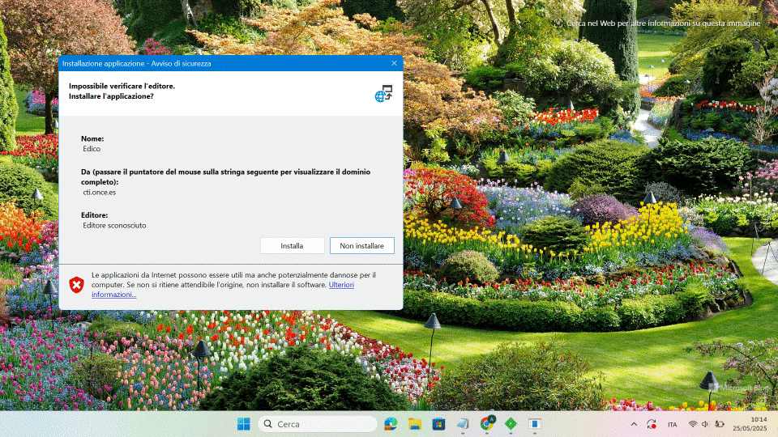

# Indisponibilità EDICO - Una soluzione "tampone"

## Premessa

 

Quella che vado a descrivere nel seguito non è un'operazione consigliata per un'installazione standard di EDICO. In due parole, se volete solo provare il programma o non avete esigenze immediate di impiego: *non fatelo*.

Niente di pericoloso né tantomeno di illegittimo, sia chiaro. Tuttavia, il procedimento descritto richiede alcune operazioni piuttosto "macchinose", che comunque permetteranno, in conclusione, di installare EDICO.

Questa guida nasce come *soluzione d'emergenza*, pensata per studenti o famiglie che, in un momento delicato come la fine dell’anno scolastico, si trovassero nella necessità di reinstallare EDICO. Al momento, però, non è più possibile farlo con le modalità standard (o almeno, non in modo semplice).

Un'ultima nota importante: alcune delle operazioni che vedremo richiedono un minimo di competenza tecnica. Se avete dubbi, *fatevi aiutare da una persona esperta*.

Non mi assumo responsabilità per eventuali problemi derivanti dall'applicazione di questa guida, anche se ho cercato di descrivere ogni passaggio nel modo più chiaro e accurato possibile. È fondamentale *capire bene cosa si sta facendo*, prima di procedere.

Fine dello spiegone. Si comincia!

---

## Cosa vogliamo fare?

Il nostro obiettivo è "convincere" il computer che l’indirizzo `cidat.once.es` (attualmente non raggiungibile dall’Italia) sia in realtà `cti.once.es` (che funziona e permette di scaricare EDICO).
Per farlo, utilizzeremo un programma chiamato **Fiddler**, insieme a un file di configurazione apposito.

---

## Cosa ci serve?

* **Fiddler Classic**, scaricabile da: [https://www.telerik.com/download/fiddler](https://www.telerik.com/download/fiddler)
* **[Il file di configurazione](edico.farx)**
* **[Il setup di EDICO Targato Italia](https://github.com/edicoitalia/edicoTI/releases/download/2024.1/edicoTI-setup.exe)**

---

## Scaricare tutto il necessario

Iniziamo scaricando **Fiddler** dal link indicato sopra. La pagina che si aprirà sarà simile a questa:

Inserite i dati richiesti (basta spuntare solo l'accettazione dei termini di licenza, come mostrato).

Nel frattempo, scaricate anche:

* Il file di configurazione (`edico.farx`)
* Il setup di **EDICO Targato Italia**

Salvate tutto all’interno di una cartella, così da avere i file a portata di mano.

---

## Installazione

1. Installate **Fiddler Classic** come un qualsiasi programma  Windows.

2. Al primo avvio, Fiddler mostrerà una finestra di dialogo come in figura:

   

   Rispondete *Yes* e proseguite.

3. Quando vi viene chiesto di partecipare a un sondaggio, potete scegliere *"Ask later"*.

4. Dal menu **File**, noterete che la voce **Capture Traffic** è selezionata. Deselezionarla in modo che appaia come in figura:

   

5. A questo punto, fra le varie opzioni nella barra degli strumenti (di destra) selezionate **Autoresponder**, come in figura.  

   

   > *Nota per utenti di screen reader: potreste dover navigare con il cursore JAWS o in modalità esplorazione per raggiungere questa opzione.*

6. A questo punto scegliere il pulsante **Import...** e andate a selezionare il file di configurazione scaricato in precedenza `edico.farx`.

7. Spuntate le seguenti due caselle di controllo:

   * **Enable rules**
   * **Unmatched requests passthrough**

8. Il risultato dovrebbe apparire come in figura:

   

9. A questo punto riabilitate il **Capture traffic** andando a selezionare l'opzione relativa dal menu File, che risulterà quindi come in figura:

   

10. Riducete Fiddler a icona (abbassarlo) **non chiudetelo!!** e avviate il setup di **EDICO Targato Italia**.

11. Al termine dell’installazione, scegliete *Edico Targato Italia* dal desktop:

    

12. Selezionate **"Continua"**, poi **"Installa"** nella finestra successiva:

    

13. A questo punto finalmente l'installazione procederà. Badare bene di tenere aperto Fiddler, se è stato chiuso o non sono state abilitate le regole o non sta catturando il traffico, qui si incepperà il tutto. Se è tutto a posto, l'installazione proseguirà

    

E finalmente si avvierà EDICO.

---

## Durante l’installazione: SmartScreen

Potrebbe comparire, in diverse fasi, la schermata di **SmartScreen** di Windows:

In questo caso, selezionate **"Ulteriori informazioni"**, poi **"Esegui comunque"**:

---

## Conclusione

Una volta installato EDICO, potete chiudere e anche disinstallare Fiddler, non sarà più necessario.
