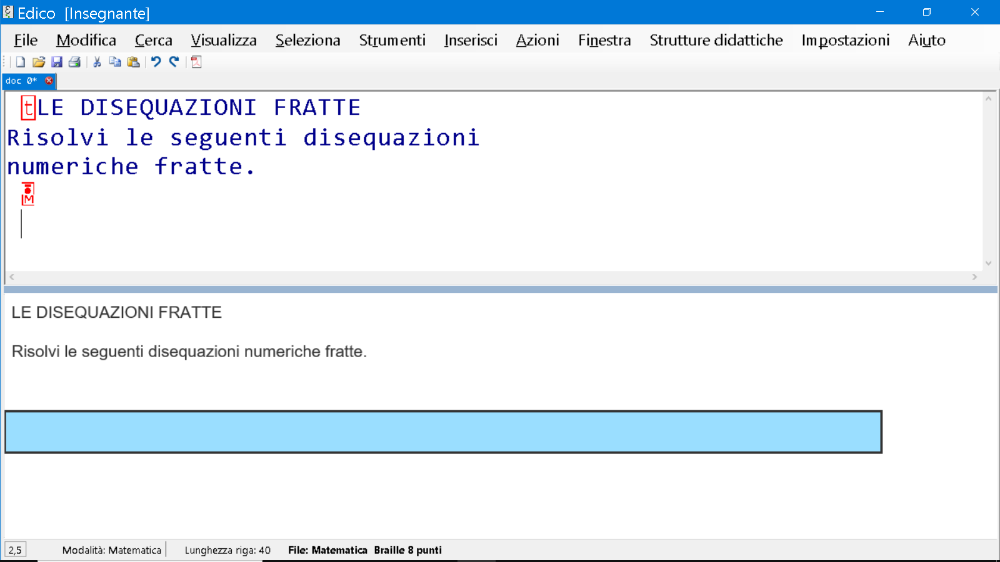
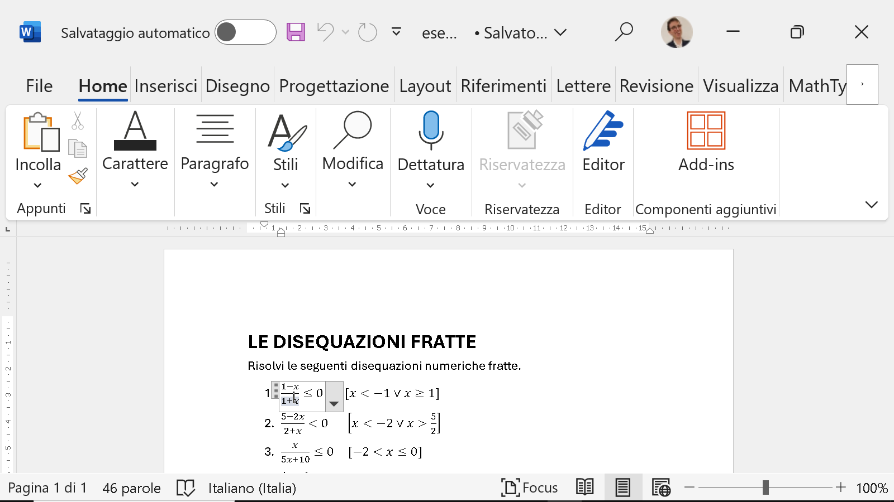
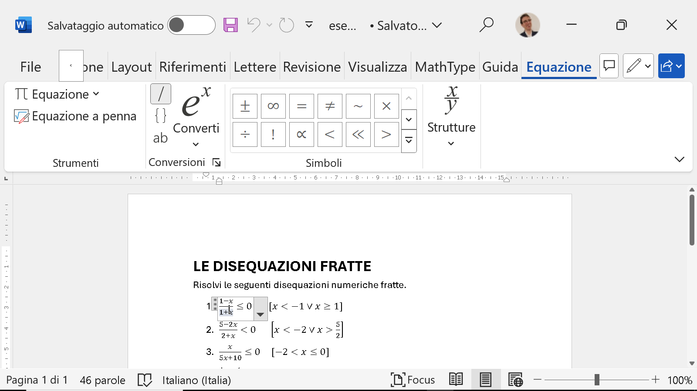
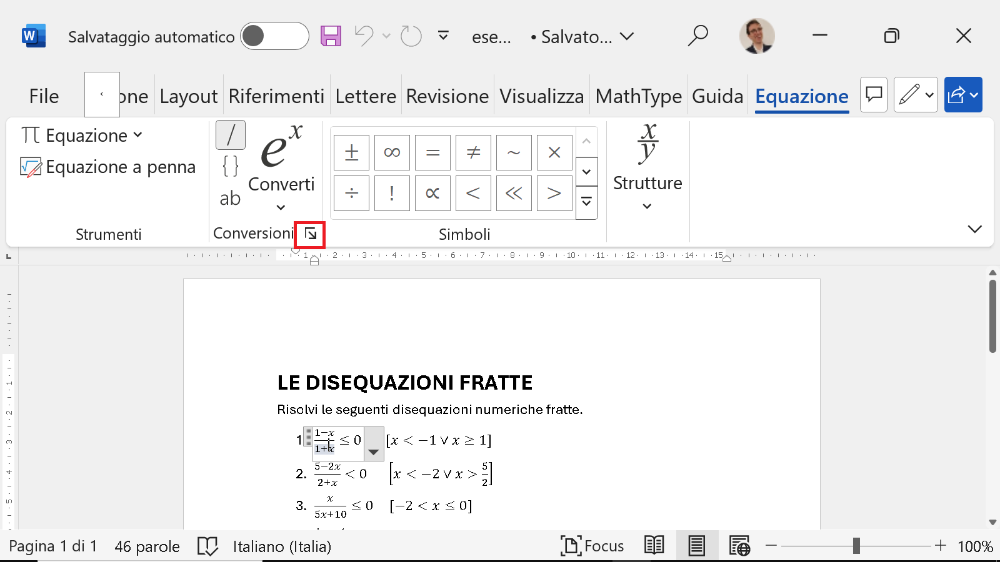
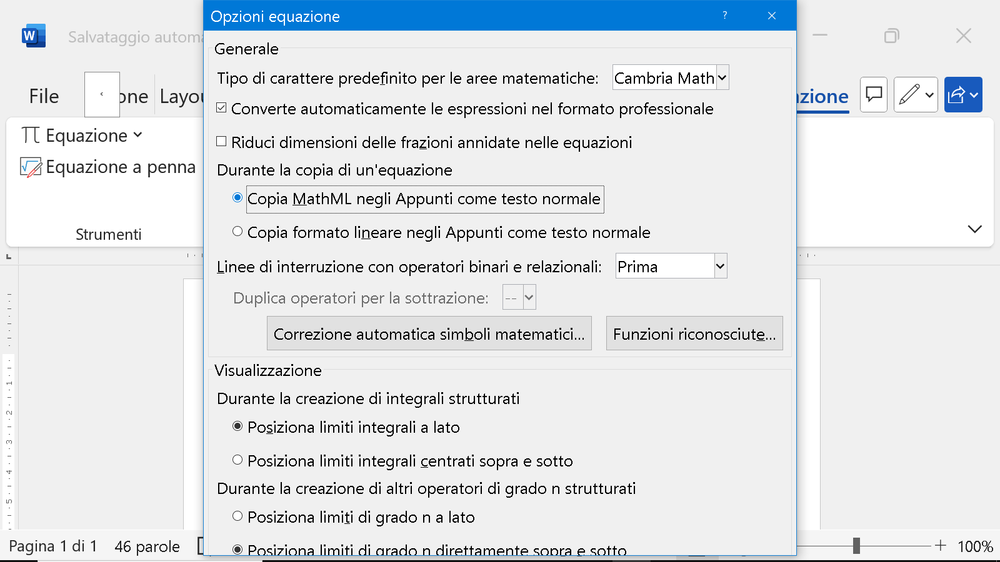
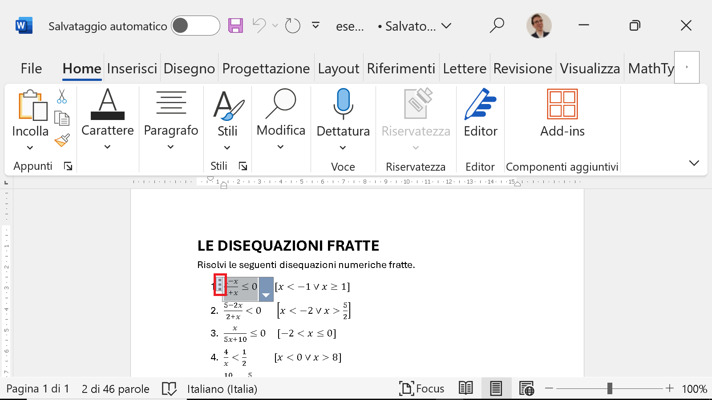
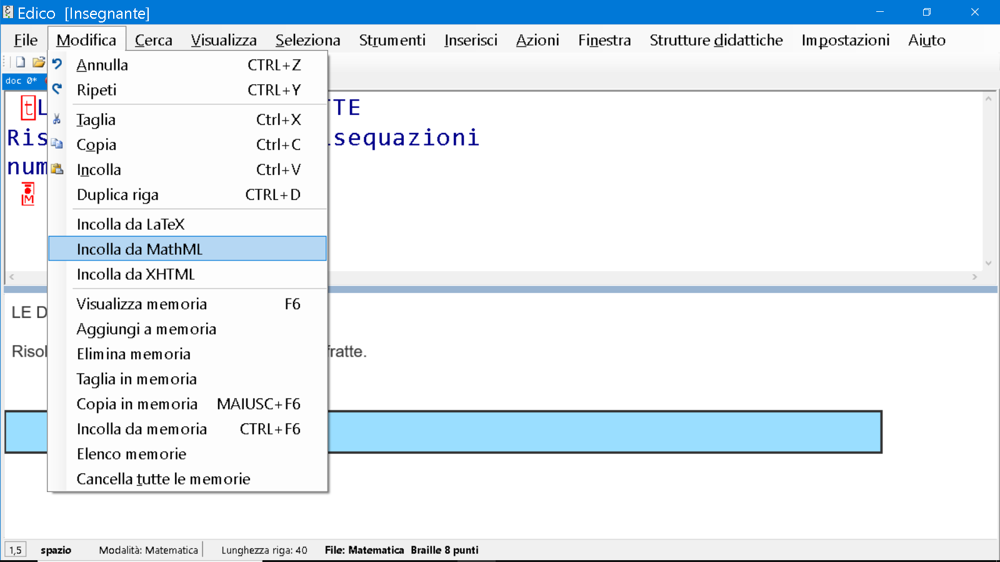
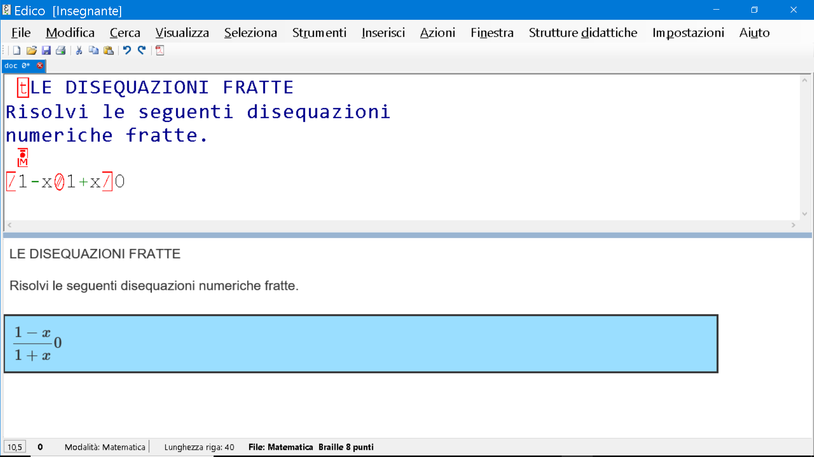
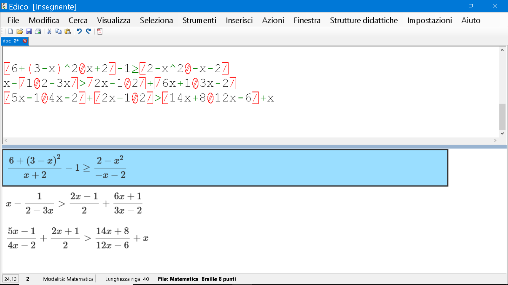

# Da Word a EDICO... quasi in un click!
* * *

## Introduzione
Questo tutorial è dedicato in special modo alle persone vedenti, come insegnanti e collaboratori, che desiderano importare contenuti da un documento di Microsoft Word contenente formule matematiche in EDICO. Sebbene la procedura possa talvolta comportare piccoli errori di trascrizione, resta una soluzione semplice e pratica da attuare per trascrivere velocemente compiti, esami o temi. Vediamo insieme i passaggi.

## Preparazione del documento in Word
Iniziamo aprendo un documento di Microsoft Word che contenga formule. Se si desidera inserire nuove formule, è possibile procedere come segue:

1. Portati alla scheda **Inserisci** nella barra multifunzione di Word, in alto.
2. Clicca su **Equazione** (di solito si trova all'estrema destra della barra).
3. Scegli di inserire una delle formule predefinite oppure clicca su **Inserisci nuova equazione** per scriverne una personalizzata.
4. Utilizza la barra degli strumenti delle equazioni che apparirà automaticamente per aggiungere simboli matematici e operatori. Si possono selezionare frazioni, radici, integrali e altri simboli complessi.
5. Dopo aver completato la formula, clicca fuori dalla casella per tornare al documento.

Per questo tutorial, utilizzeremo un documento d'esempio che puoi scaricare [qui](esempio_word.docx).

**Nota importante**: Le formule di Microsoft Word che possono essere importate in EDICO devono essere create con gli strumenti di Office 2007 o versioni successive. L'uso di software di terze parti o dell'obsoleto Equation Editor, presente fino a Word 2003, rende l'operazione più complicata.

## Esame preliminare del documento
Diamo uno sguardo al documento da convertire. Noteremo che è composto sia da testo semplice che da formule matematiche.

### Copia del testo semplice
Per copiare il testo semplice:

1. Seleziona le righe di testo desiderate.
2. Premi **Ctrl+C** per copiare il testo.
3. In EDICO, apri il menu **Modifica** e scegli l'opzione **Incolla**.
   
Ecco un esempio di testo incollato correttamente in EDICO:

Porta il cursore alla fine del testo importato, in una nuova riga, pronto per l'inserimento delle formule.

## Configurazione di Word per copiare le formule
Torniamo in Word.
Alla terza riga del nostro esempio ci sono due formule: una con l'esercizio e una con la soluzione. Prima di importarle in EDICO, configuriamo Word in modo che la copia sia compatibile:

1. Posiziona il cursore all'interno della formula.

2. Nella barra multifunzione di Word, seleziona la scheda **Equazione** (questa scheda appare solo quando sei all'interno di una formula).

3. Fai clic sull'icona vicino a **Conversioni** come in figura.

4. Nella finestra delle impostazioni, assicurati che sia selezionata l'opzione **Copia MathML negli appunti come testo normale**.

5. Conferma cliccando su **OK**.

Questa configurazione è necessaria solo una volta, ma è utile verificarla quando ci si appresta ad eseguire queste operazioni, per garantire che Word sia pronto per copiare le formule nel formato corretto.

## Importazione delle formule in EDICO
Procediamo con la copia delle formule:

1. Seleziona la formula cliccando sui tre puntini accanto ad essa, oppure, se usi uno screen reader, inizia dalla prima parte della formula e mantieni premuto **Shift** fino a selezionarla interamente.

2. Premi **Ctrl+C** per copiare.
3. Passa a EDICO, apri il menu **Modifica** e scegli **Incolla MathML**.

4. Verifica l'importazione: potrebbe essere necessario fare piccole correzioni, come l'aggiunta di qualche segno mancante, nel nostro esempio il minore e uguale.

## Conclusione
La procedura non è perfetta e potrebbero essere richiesti piccoli aggiustamenti, come la sistemazione degli esponenti interpretati come apici. Tuttavia, è un metodo estremamente pratico per importare formule complesse. Dopo una rapida revisione, otterrai un risultato preciso e pronto per l'uso.
Qui sotto riportiamo ad esempio l'immagine contenente le ultime tre righe del documento, particolarmente complesse, trascritte da Word in EDICO.

